# Stripboard Studio — manual

A guided tour of every option. Screenshots are referenced below; the exact shots to capture
are listed in [`docs/SCREENSHOTS.md`](docs/SCREENSHOTS.md) and stored in `manual/img/`.

> New to it? Read **Overview**, then **Solve** and **Print/PDF** — that is the core loop.
> See also the shorter, feature-oriented [`README.md`](README.md).

---

## 1. Overview

Stripboard Studio turns a small circuit into a buildable stripboard layout. The screen has
three parts: the **parts palette** (left), the **board** (center, with the **version tabs**
above it), and the **Properties / Nets / Problems** panel (right).

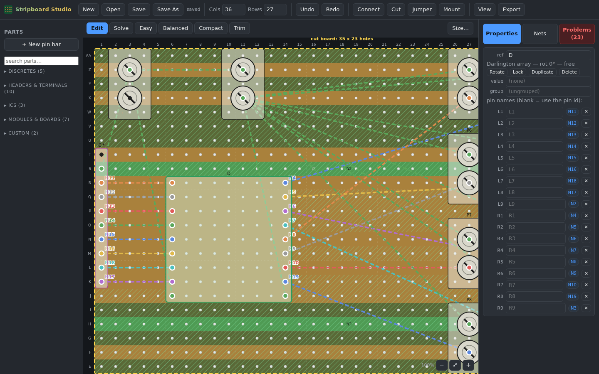

## 2. Run it

Serve the folder over HTTP (`npm start`, or any static server) and open it in a browser.
There is no install, no build step and no dependency. Everything runs locally.

## 3. The board and coordinates

Columns are numbered left→right and rows are lettered with **A at the bottom** (`AA`, `AB`, …
after `Z`). A hole is named `row + column`, e.g. `H7`. Every hole is on a 2.54 mm grid.

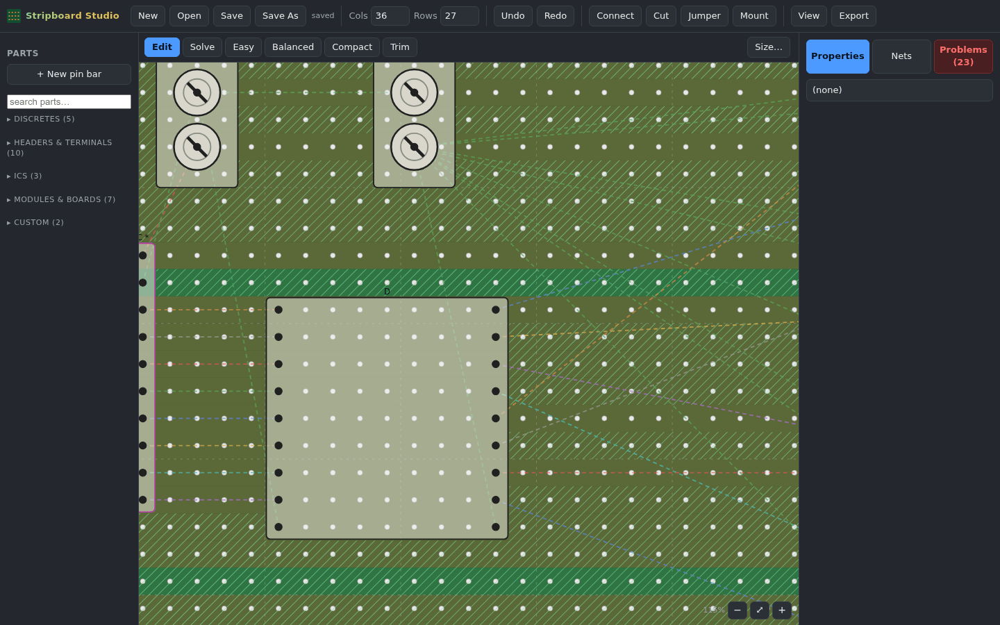

## 4. Parts palette

Click a part to add it. The palette is grouped (**Recent / Discretes / Headers & terminals /
ICs / Modules / Custom**) with a **search** box. **+ New pin bar** lets you define a custom
single- or double-row bar with its own pin count, row gap and pin prefixes.

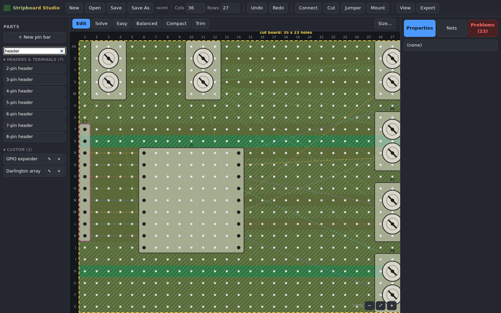

## 5. Placing and editing parts

Click a part on the board to select it. In **Properties** you can edit its **ref**, **value**
(feeds the BOM), **group**, and per-pin **names**, and use the contextual actions
**Rotate / Lock / Duplicate / Delete**.

## 6. Moving, rotating, spans

Drag a part to move it; `R` rotates (0/90/180/270); `L` locks it. Two-lead parts (resistor,
capacitor, LED, diode) are **bendable**: drag a lead (Shift+drag) to change the **span**.

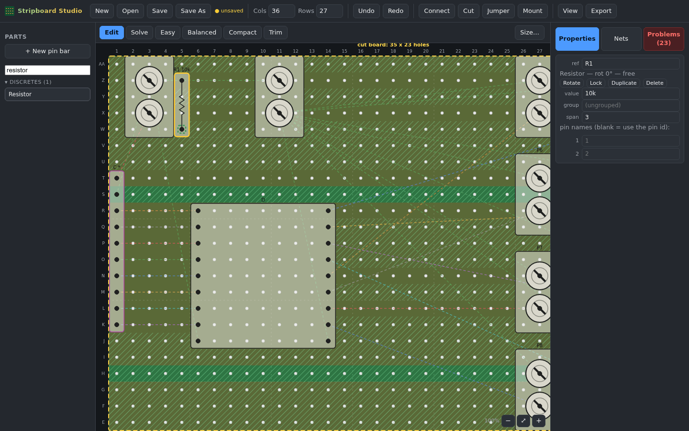

## 7. Multi-selection and marquee

**Shift+click** a part to add/remove it from the selection; **drag on the empty board** to
rubber-band select. Move / `R` / `L` / `Delete` / `Ctrl+D` / `G` then act on the whole
selection (`Properties` shows "N parts selected").

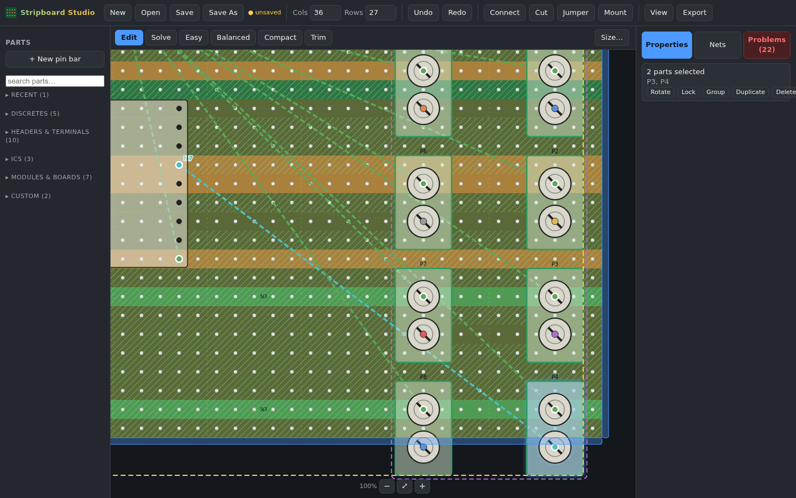

## 8. Groups (semi-locked parts)

Parts with the **same group name** stay rigidly fixed *relative to each other*, but the whole
cluster can still move. Select a part and press **`G`** to start a group (`G1`) or add to the
active group; **Shift+G** removes; `Esc` ends the session. A locked member fixes the whole group.

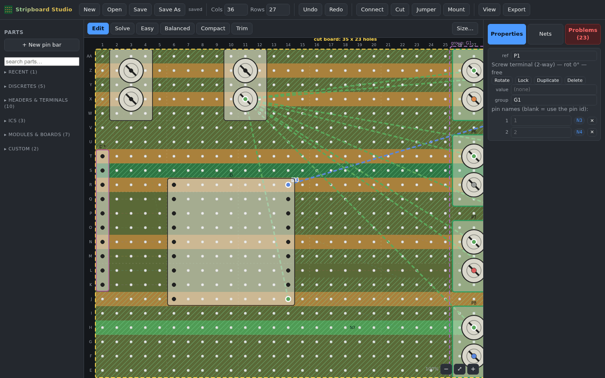

## 9. Connect pins and edit nets

Use **Connect** (`C`) and click two pins to join them. In the **Nets** tab (and the net's
Properties) you can rename a net, remove a pin (`✕`), **split** a pin (`✂`) or several pins of
the selection into a new net, and **merge** a net into another.

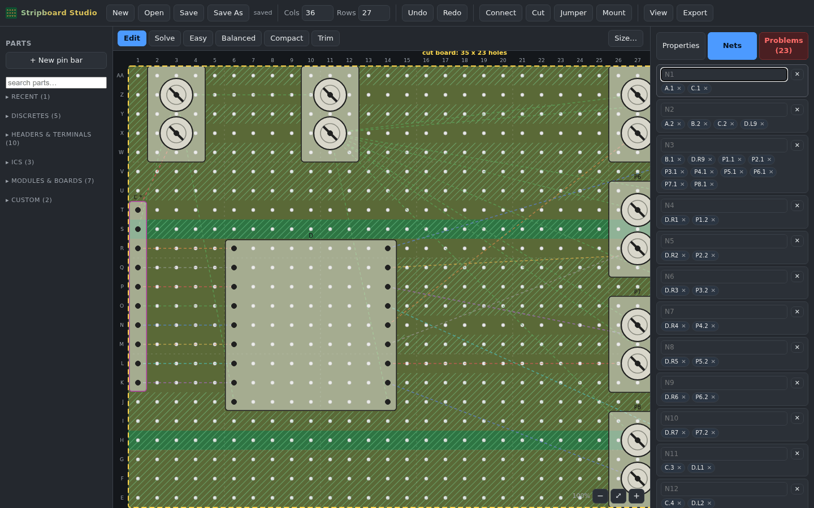

## 10. Tools: Cut, Jumper, Mount

- **Cut** (`X`): click a hole to cut that strip; click again to remove it.
- **Jumper** (`J`): click a hole, then another in the same column; it returns to Select.
- **Mount** (`M`): click a hole to place a chassis screw hole (default Ø3.2 mm).

Hand-placed objects are **fixed** by default, and **deleting one stays deleted** (a later Solve
will not recreate it).

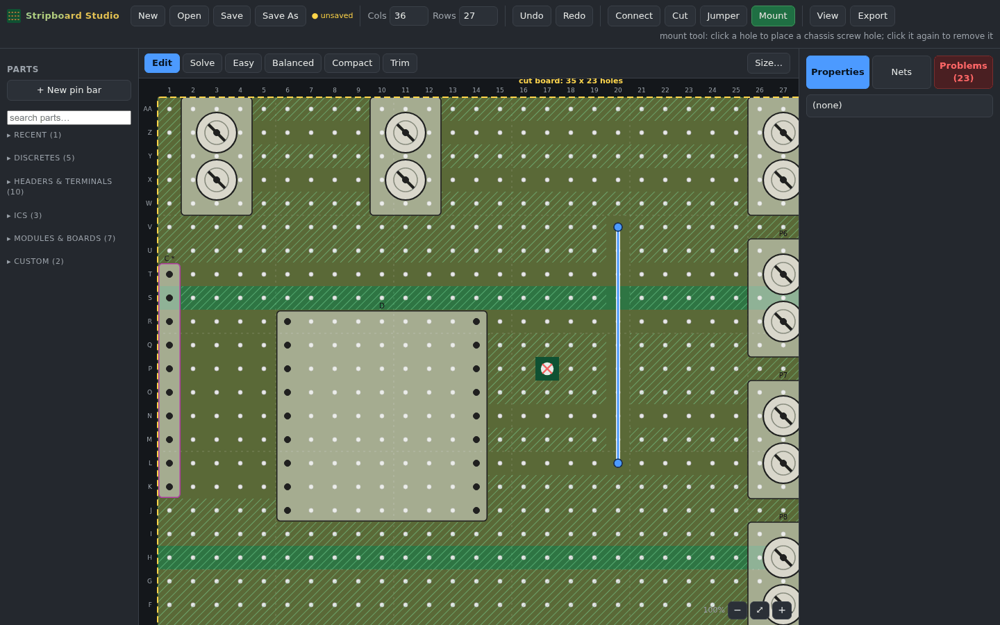

## 11. Solve

**Solve** routes the current placement: it chooses **cuts** and **jumper** wires (with detours
for crossovers) and aligns cuts into a column where possible. Fixed jumpers/cuts are respected.

## 12. Easy / Balanced / Compact

These also move unlocked parts. **Easy** prefers **few jumpers** and breathing room;
**Balanced** trades everything evenly; **Compact** prefers a **small board**. They are one
objective with three weight presets (same search budget), and run **cooperatively** (the tab
stays responsive, with an elapsed-time counter).

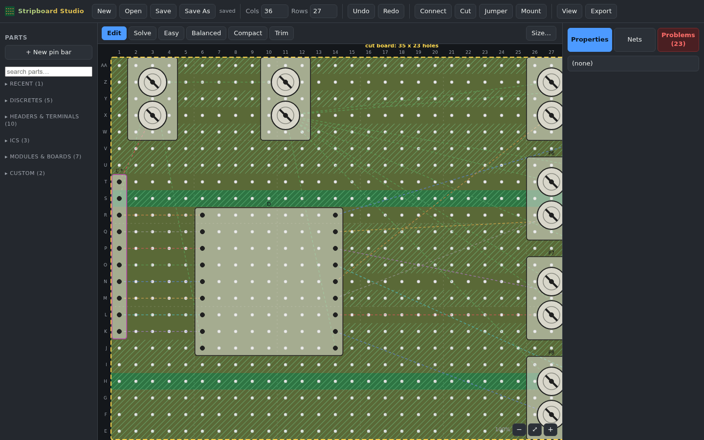

## 13. Crop

**Crop** removes unused margins of whatever board is on screen: it shifts the existing routing,
cuts and mounting holes and shrinks the board — without re-solving.

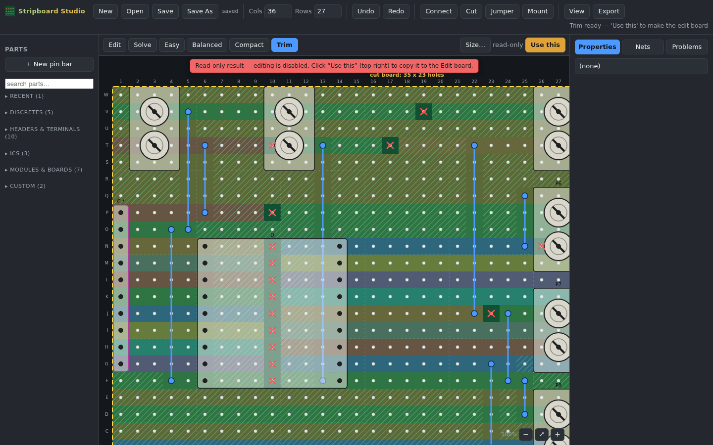

## 14. Size… (board-size search)

**Size…** tries a few board sizes and lists the **non-dominated trade-offs** (smaller board ↔
fewer jumpers/cuts). **Apply** swaps in the chosen board (one undo step). It is slow by nature.

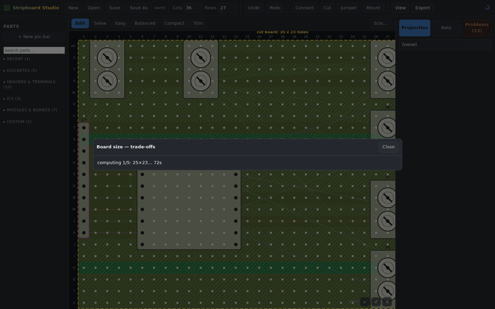

## 15. Views

The **View** menu shows/hides parts, wires, cuts, copper, nets and the grid, and toggles the
copper side, pin names, connections, **mountable zones**, **diagonal jumpers** and the
circuit view — plus **Theme** and **Language**.

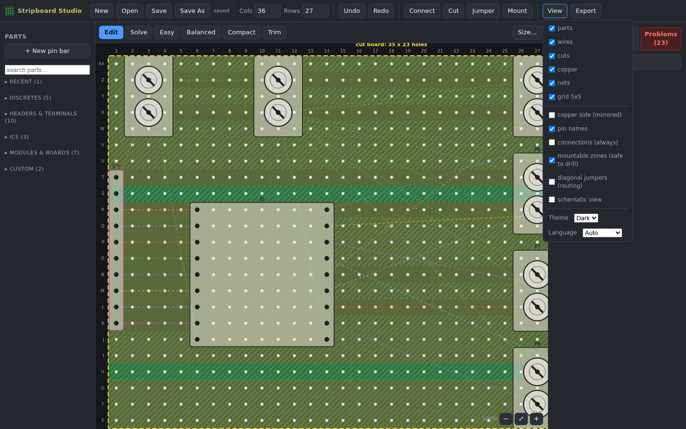

On tablets and phones the side panels become **drawers**: use the **Parts** and **Panel**
buttons in the toolbar; tap the board (or press `Esc`) to close them. Touch: **drag** the empty
board to pan, **pinch** to zoom, and use the **Box** button to rubber-band select (drag then
selects a box instead of panning). The desktop layout and mouse behavior are unchanged.

## 16. Copper side and circuit view

The **copper side** is mirrored and drawn without parts (so you can work on the copper side as
it will look), with the labels moved to the mirrored edges. The **circuit view** is a
read-only symbol drawing of the same circuit (a view, not a schematic editor).

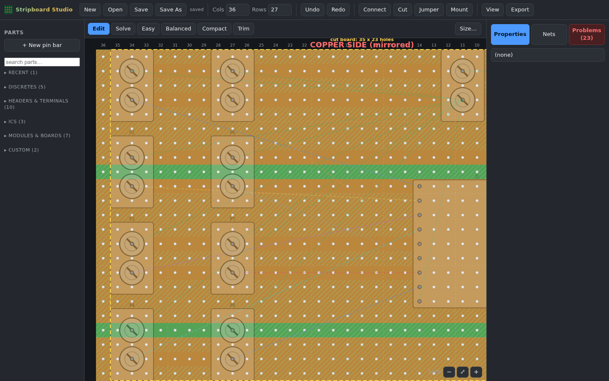

## 17. Mountable zones

Tick **mountable zones** to hatch the cells where a mounting hole would not affect any net
(idle/dead-end copper) — where it is safe to drill.

## 18. Zoom and pan

Zoom with the **mouse wheel** (at the cursor) or `+` / `−`; **middle-drag** or **Space+drag**
to pan; `0` fits to the window. The zoom % is shown bottom-right. On **touch**: **drag to pan**,
**pinch to zoom** (or the `+` / `−` / ⤢ buttons).

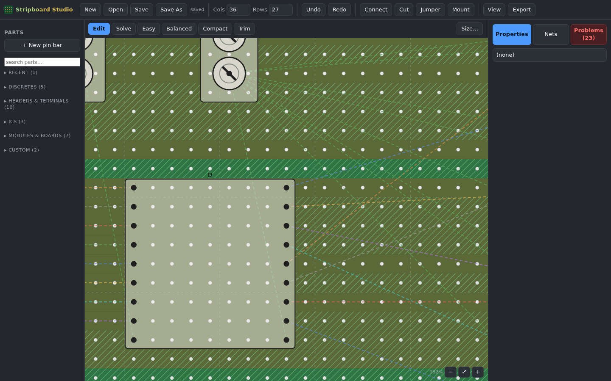

## 19. Problems (DRC)

The **Problems** tab lists short circuits, open nets, off-board pins, overlaps, jumpers under a
body, mounting holes on pins, no-room-to-cut, spare pins and one-pin nets. Click an item to
highlight the net or component.

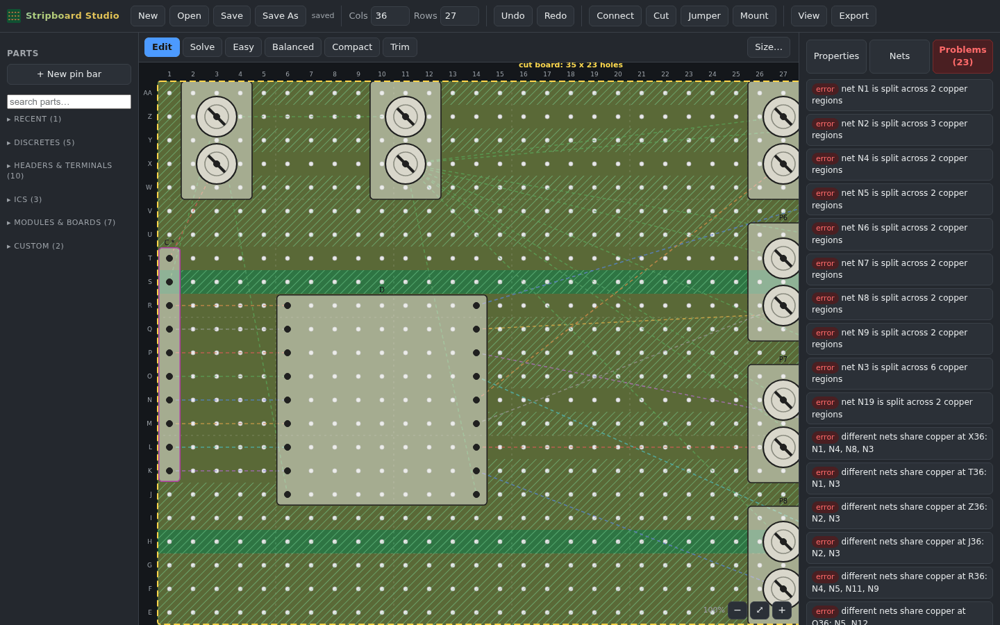

## 20. Print / PDF

**Export → Print / PDF (1:1)** opens a dialog where you choose a label **origin** and which
**sections** to include: component side, copper side, mounting holes, cuts, jumpers, BOM,
assembly steps and **electrical checks**. Print at **100%** (no "fit to page"); the
mounting-holes section also lists the **centre-to-centre distances in mm**, useful for an
enclosure.

The **electrical checks** sheet is a multimeter guide for before you apply power: **net
continuity** (which pins should beep for each net), **isolation** (different nets must be
open), **per-cut** separation (the two neighbouring holes must be open after cutting), and
**per-jumper** continuity.

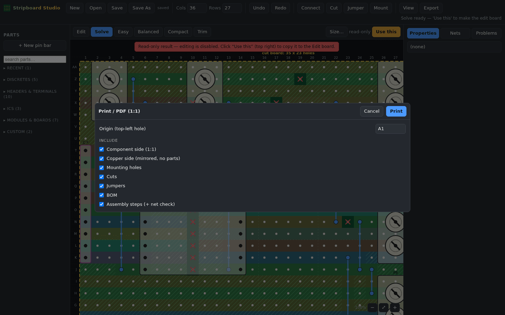

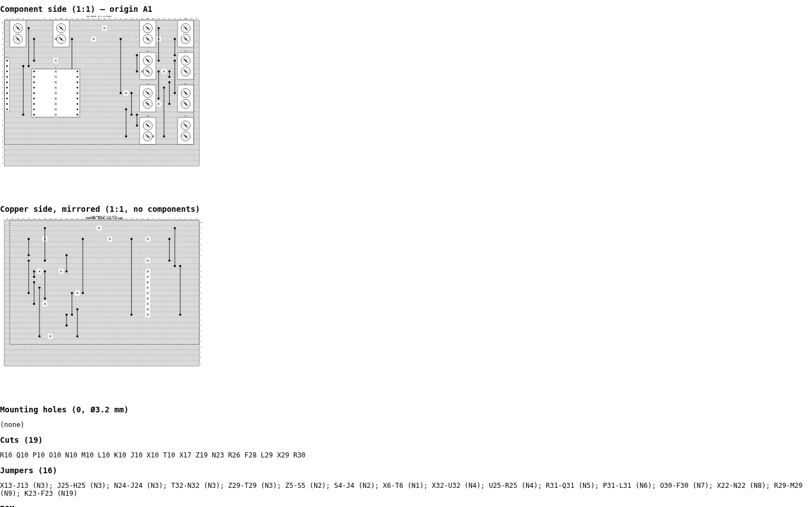

## 21. Export: Netlist and Text

**Export → Netlist…** produces JSON / SPICE / KiCad netlists; **Text (ASCII)…** dumps the whole
board as plain text (cuts, jumpers, mounting holes and their spacing).

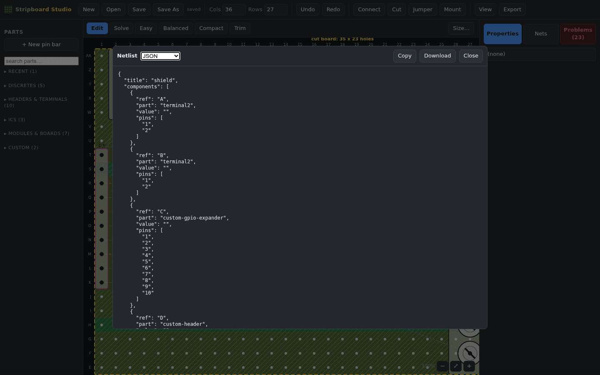

## 22. Save, Open, autosave

**Save / Save As** write a human-readable JSON (names are never reused: `board`, `board (1)`…).
**Open** restores it. The edit board is **autosaved** in the browser and recovered on reload,
and unsaved changes are guarded.

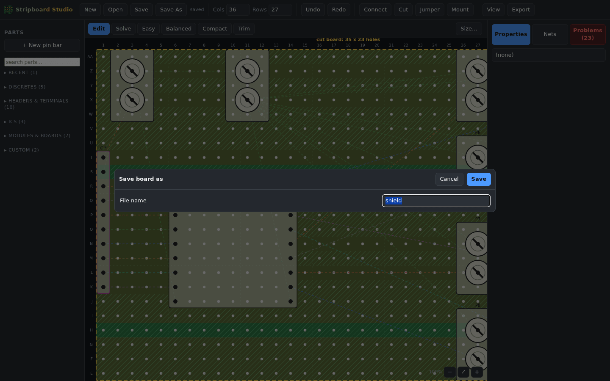

## 23. Theme and language

**View → Theme** (Auto/Light/Dark; Auto follows your system) and **View → Language**
(Auto/English/Português; Auto follows your browser).

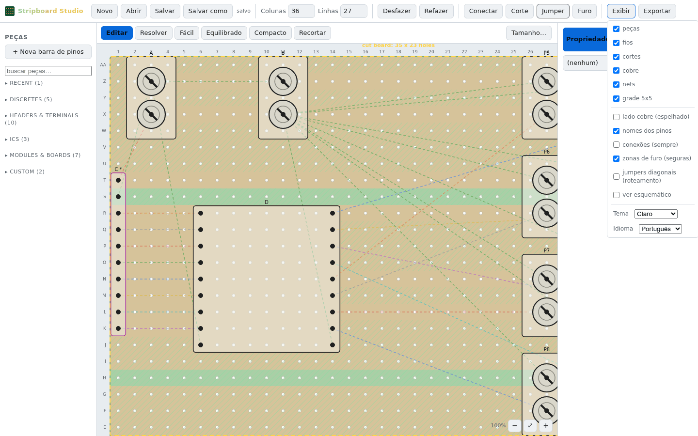

## 24. Keyboard shortcuts

| Key | Action |
|---|---|
| `V` / `C` / `X` / `J` / `M` | select / connect / cut / jumper / mount tool |
| `R` | rotate 90° (`Shift+R` the other way) |
| `L` | lock/unlock a part, or fix/unfix a jumper/cut |
| `G` / `Shift+G` | add to group / remove from group |
| `Ctrl+D` | duplicate the selection |
| `Delete` / `Backspace` | delete the selection |
| Arrows | nudge the selection |
| `Esc` | clear selection / cancel a tool / end group session |
| `+` / `−` / `0` | zoom in / out / fit |
| `Shift`+drag a lead (or `Alt`+drag) | change a bendable part's span |
| `Space`+drag or middle-drag | pan the board |
| `Ctrl+S` / `Ctrl+Shift+S` | save / save as |
| `Ctrl+O` / `Ctrl+N` | open / new |
| `Ctrl+Z` / `Ctrl+Y` or `Ctrl+Shift+Z` | undo / redo |
| `Ctrl+Shift+O` / `Ctrl+Shift+E` / `Ctrl+Shift+C` | balanced / easy / compact |
| `Ctrl+Shift+T` | crop to content |
